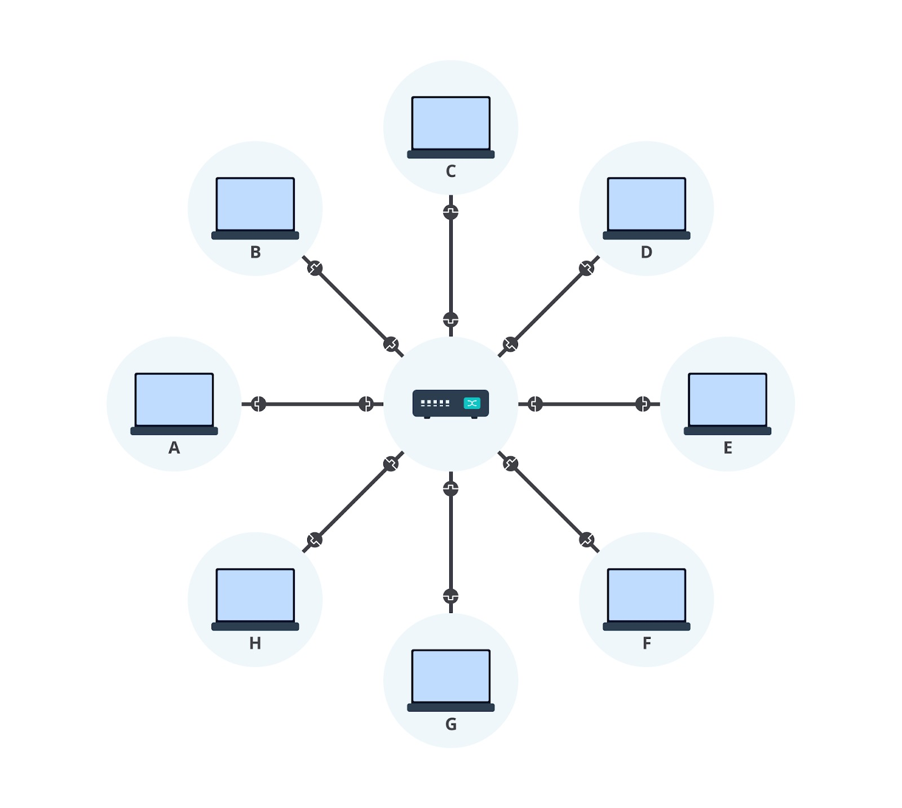
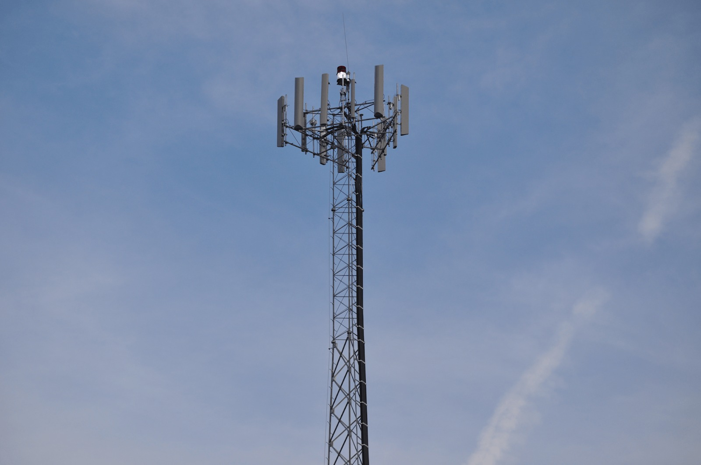
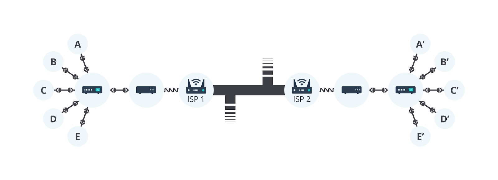

# Cara Internet Bekerja

Apakah Anda tahu bagaimana website dapat diakses dan ditampilkan dengan baik 
pada user? Sebagian dari Anda pasti memiliki jawaban bahwa website akan tampil jika 
kita memiliki alamat website, browser, dan yang tidak kalah penting adalah koneksi internet. 
Yap, hal tersebut tidaklah salah. Jika berpikir lebih dalam, kita akan mengira bahwa ada 
sesuatu yang terjadi di belakang dan tidak terlihat secara kasat mata manusia. Bagi yang 
belum paham pengertian browser dan website, kita akan mengulasnya pada materi berikutnya. 

Bayangkan bahwa internet merupakan sebuah jalan yang menghubungkan diri kita pada suatu tujuan 
untuk mendapatkan sesuatu yang diincar. Contohnya, jika Anda seorang pelajar yang ingin mendapatkan 
banyak ilmu, sekolah adalah jalan untukmencapai tujuannya. Anda dapat masuk ke kelas dan diizinkan 
oleh pihak sekolah untuk menimba ilmu dari seorang guru. 

Analogi di atas mirip seperti website. Internet akan memberikan kemampuan pada user untuk mengirimkan 
permintaan dan menerima hasil permintaan (data) pada website. Hal ini terjadi juga pada Anda ketika 
mengakses website dicoding.com. Namun, apakah Anda tahu ke mana website mengirimkan permintaan dan dari 
mana data dapat diperoleh? 

Sebenarnya, hal di atas terjadi karena komputer milik user terhubung dengan komputer lain yang biasa 
disebut dengan server. Kedua komputer ini berkomunikasi melalui sebuah jaringan, baik dengan kabel atau 
nirkabel. Server menerima permintaan yang dikirimkan dan menanggapi hasil permintaannya sehingga website 
dapat ditampilkan di komputer user. 

Dengan konsep yang sederhana, bayangkanlah gambar di bawah merupakan bagan terhubungnya dua buah 
komputer untuk berkomunikasi. 

Lalu, bagaimana cara satu komputer dapat terhubung pada lebih dari satu komputer lainnya? 
Jawabannya, Anda perlu terhubung dengan sejumlah komputer agar dapat berkomunikasi. 

Apakah Anda sudah memahami maksud dari bagan di atas? Satu komputer yang ingin melakukan koneksi ke banyak 
komputer perlu menyediakan koneksi ke sejumlah komputer tersebut. Pada akhirnya, Anda akan menemui banyak 
garis-garis yang terhubung dari satu komputer ke komputer lainnya. Hal yang sama dilakukan juga ketika komputer 
lain ingin terhubung. 

Bagan di atas memang bukanlah cara yang efektif karena perlu mengatur koneksi untuk masing-masing 
komputer. Hal ini dapat diselesaikan dengan sebuah alat yang menghubungkan banyak komputer sekaligus. 
Perkenalkan, alat bernama network switch. 

Tidak hanya menghubungkan banyak komputer sekaligus, network switch juga dapat terhubung dengan network 
switch lain sehingga jaringan yang terbentuk makin besar. 

# Interconnection Network

Semakin besar jaringan yang diciptakan, semakin banyak komputer yang akan terhubung dan berkomunikasi. 
Komputer Anda dapat terhubung dengan komputer keluarga, teman, bahkan hingga tetangga-tetangga. Masih 
banyak pula saudara-saudara kita di belahan bumi lainnya untuk bisa saling terkoneksi. Namun, bukankah 
itu merupakan cara yang tidak efektif, bahkan benar-benar mustahil jika masih menggunakan koneksi kabel 
atau nirkabel bagi user? Oleh karena itu, perkenalkanlah jaringan yang bernama Interconnection Network 
atau yang biasa dikenal dengan Internet. 

Untuk terhubung dengan semua orang di dunia, kita dapat memanfaatkan infrastruktur telepon yang biasanya 
sudah terhubung di rumah-rumah. 

Kita perlu menghubungkan komputer dengan infrastruktur telepon menggunakan alat yang dinamakan modem. 
Nah, apakah kita sudah dapat berkirim pesan dengan saudara jauh sekarang? Jawabannya, masih ada satu 
langkah lagi, yaitu jaringan kita perlu terhubung ke Internet Service Provider (ISP). 

ISP adalah sebuah perusahaan yang mengelola beberapa router khusus yang saling terhubung dengan router 
ISP lainnya. Dengan inilah kita bisa berkomunikasi, bahkan dengan orang di benua lainnya. 

Begitulah cara internet bekerja sehingga kita bisa terhubung dengan orang lain meskipun dalam kontinen 
yang berbeda. Dengan ini, Anda sudah memiliki modal untuk memahami cara website dapat sampai pada perangkat 
user. 

