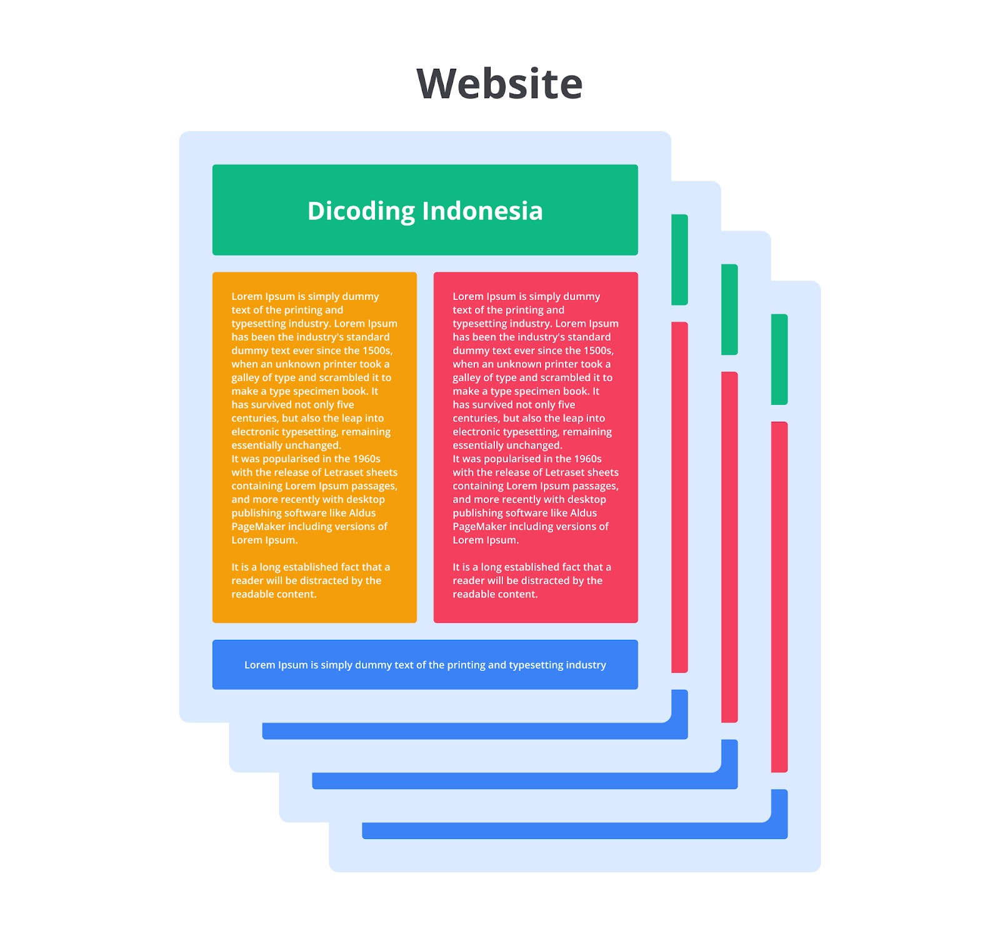
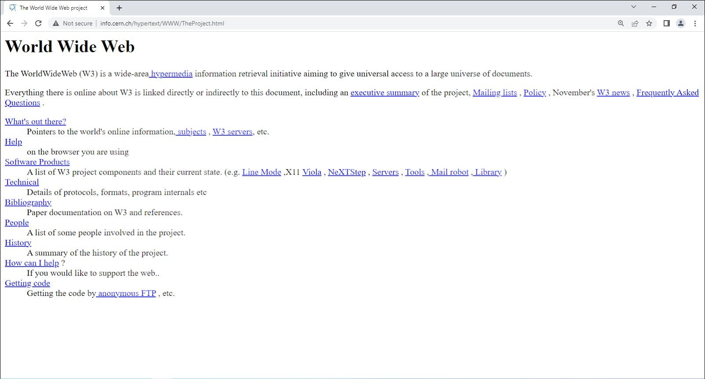
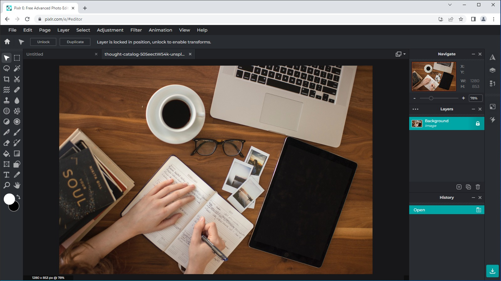

# Website dan Halaman Web

Adakah di antara Anda yang masih awam tentang website? Saya jamin Anda semua sudah mengetahuinya, 
baik secara sadar maupun tidak sadar. Buktinya, saat ini Anda sedang mengakses website milik Dicoding 
untuk menimba ilmu dalam bidang web development. Meskipun demikian, kita akan menggali memahami tentang 
website dan halaman web. Bahkan, kita akan mengenal perbedaan antara keduanya. 

# Halaman Web

Halaman web merupakan halaman tunggal yang menampilkan informasi, baik berupa teks, gambar, maupun media 
lainnya. Tidak hanya media yang ditampilkan, halaman web yang dibangun dapat ditambahkan interaktivitas 
menggunakan kode (JavaScript). 

Berikut adalah contoh salah satu halaman web yang dapat Anda akses. 

Halaman web di atas berisi banyak media yang disajikan hingga interaktivitas pengguna yang banyak. 
Halaman web yang diakses akan ditampilkan oleh browser menggunakan beberapa komponen pembangunnya. 
Kita akan membahas komponen-komponen ini pada materi Anatomi Website. 

# Website

Jika sebelumnya Anda belajar halaman web berupa halaman tunggal, website adalah sekumpulan halaman web 
yang saling terhubung. Website bersifat unik karena setiap halaman dapat saling terhubung dengan 
menggunakan hipertaut (hyperlink), baik dalam domain yang sama maupun berbeda. 

Umumnya website memuat informasi yang disediakan secara perorangan, kelompok, atau organisasi. Semua 
informasi yang tersedia pada halaman website disimpan pada server. Kita akan membahas mengenai server 
pada materi berikutnya. 

# Perkembangan Aplikasi Web

Website merupakan teknologi yang sudah ada sejak 30 tahun silam. Tim Berners-Lee, seorang ilmuwan Inggris 
menemukan World Wide Web atau disingkat WWW pada tahun 1989 ketika ia bekerja di CERN (Conseil Européen pour 
la Recherche Nucléaire). Awalnya, web dibuat dan dikembangkan untuk memenuhi permintaan dalam berbagi informasi 
secara otomatis antar ilmuwan di universitas dan lembaga di seluruh dunia. 

Web pertama di CERN didedikasikan sebagai web pertama di dunia. Selain itu, pada tahun 2013, CERN merilis 
“a project to restore this first ever website: info.cern.ch” untuk mengabadikan website pertama di dunia. 
Berterimakasihlah pada CERN dan Tim Berners-Lee! 

Gambar di atas adalah website pertama yang dibuat, kita bisa menjelajahinya di info.cern.ch. 

Website sudah berkembang sangat pesat. Sekarang, website tidak hanya digunakan untuk platform berbagi 
informasi atau berita. Layaknya aplikasi pada komputer dan telepon genggam, website dapat digunakan untuk 
komunikasi secara real-time, menyetel sebuah rekaman audio, hingga mengedit foto atau video. 

Salah satu aplikasi berbasis web untuk melakukan pengeditan foto, adalah pixlr.com. Tampilannya seperti 
gambar berikut. 

