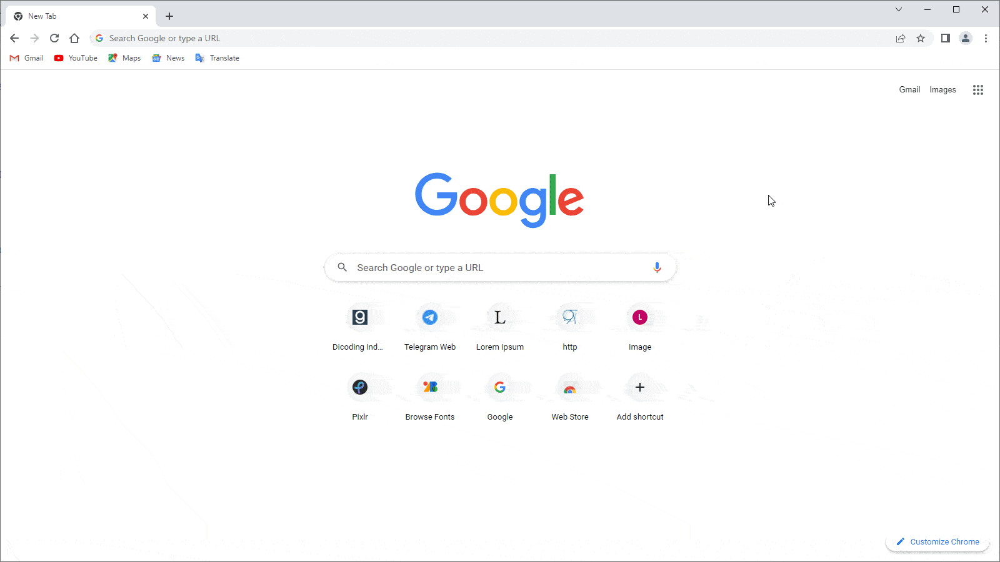
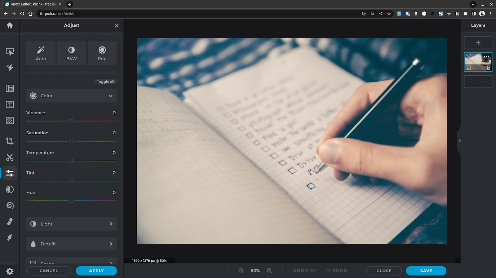

# Web Browser

Dalam situasi bepergian menggunakan transportasi kapal, kita perlu memasuki awak kapal melalui pelabuhan 
kapal. Bagaimana jika Anda naik kapal melalui terminal bus atau stasiun? Hal tersebut tidak akan bisa, 
bukan? Hal ini karena pelabuhan kapal merupakan akses satu-satunya untuk menaiki dan melakukan perjalanan 
dengan kapal. 

Sebagaimana website, kita memerlukan software sebagai kapal untuk menjelajahi beragam destinasi pulau. 
Tidak lupa juga dengan nama domain sebagai tiket untuk mengaksesnya. 

Web browser atau disingkat browser merupakan sebuah program yang menampilkan halaman web. Tidak hanya satu 
halaman web, tetapi banyak website yang aktif di dunia ini dapat diakses oleh browser. Bahkan, halaman web 
yang saling terhubung dalam satu domain yang sama juga dapat diakses. 

Ada banyak vendor-vendor browser yang dapat digunakan. 

1. Mozilla Firefox
2. Google Chrome
3. Microsoft Edge
4. Opera Browser
5. Dan masih banyak lagi

Saat ini, Anda mungkin mengakses website ini menggunakan browser selain yang kami sebutkan. Hal tersebut 
juga merupakan salah satu software pengakses website. Jadi, silakan gunakan browser pilihan Anda. 

# Cara Browser Bekerja

Ketika user mengakses website dengan URL, browser akan membuat sebuah request yang akan dikirimkan ke web 
server. Kemudian, web server akan mengirimkan response berisi konten-konten yang dibutuhkan oleh website 
dan browser akan memprosesnya hingga tampil website pada perangkat user. 

Browser memiliki address bar yang merupakan sebuah input bagi user untuk menuliskan alamat website atau yang 
biasa disebut Uniform Resource Locator (URL). Ada tiga bagian pada URL, yaitu protocol (https), domain name 
(dicoding.com), dan file path (alamat halaman web yang sedang ditampilkan). 

Client dan web server berkomunikasi dengan protokol yang bernama HyperText Transfer Protocol (HTTP). 
Ketika user membuka website dengan URL, browser akan membuat dan mengirimkan HTTP request ke web server, 
serta menerima HTTP response yang dikirimkan oleh web server sebagai hasil request. Lalu, browser akan 
menampilkan halaman web berdasarkan konten-konten yang dikirimkan (HTML, CSS, JavaScript, dsb.). Proses 
ini juga bisa disebut sebagai request-response cycle.

