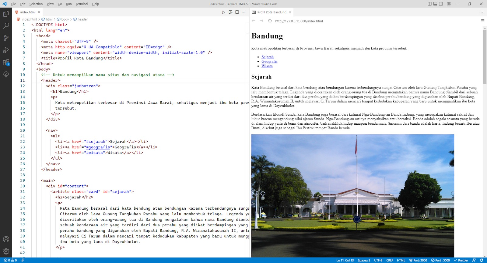
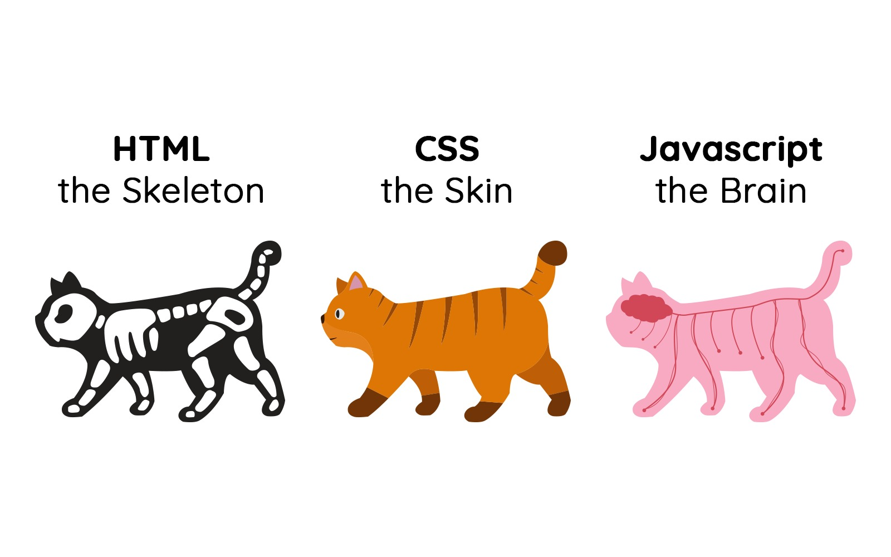
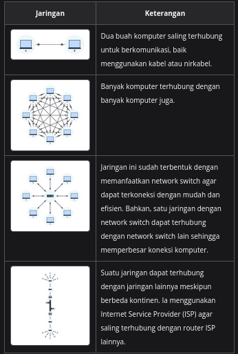
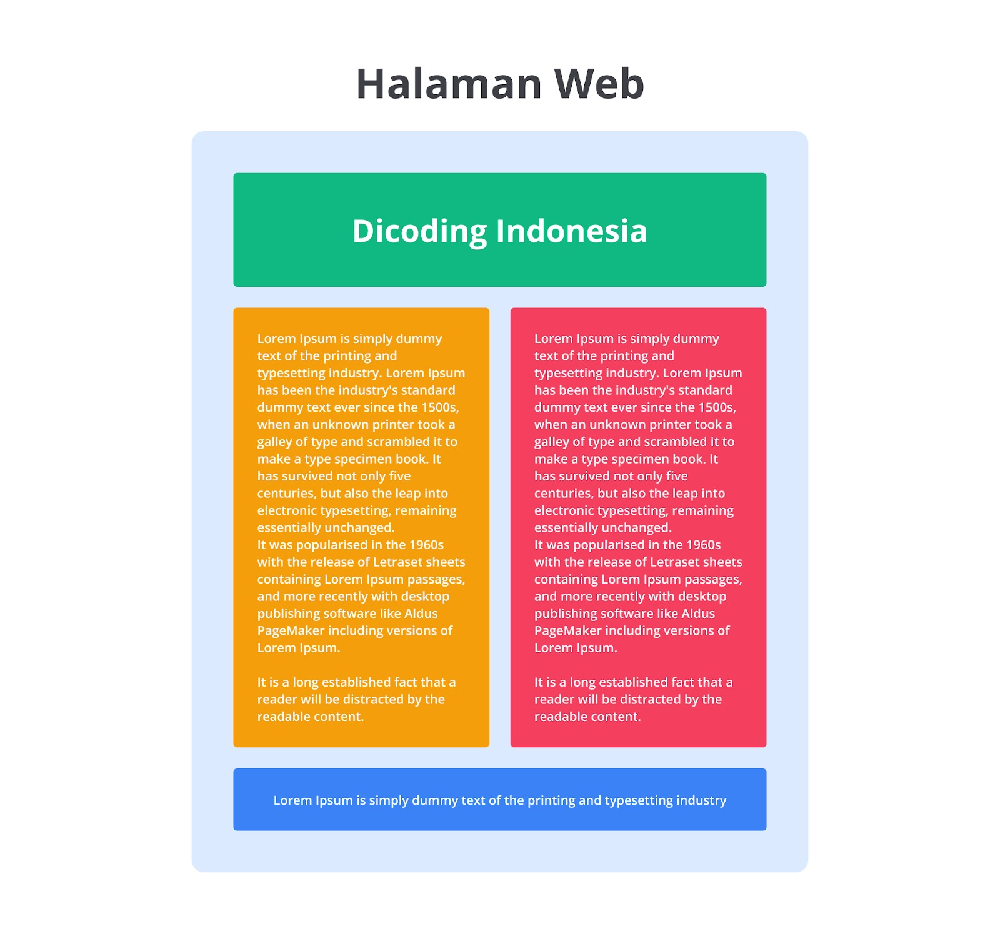
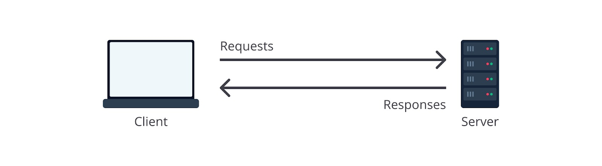
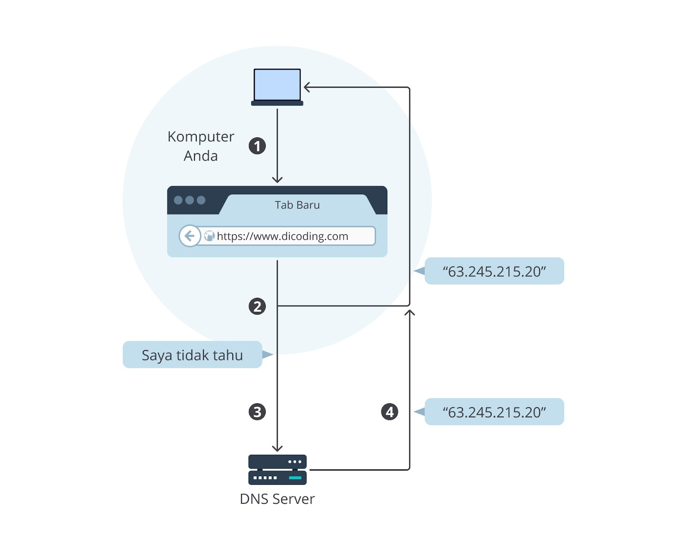

# Anatomi Website

Luar biasa! Hingga saat ini, Anda sudah memahami tentang cara internet bekerja, website dan halaman 
web, serta web server. Pasti Anda sudah tidak sabar membuat website yang bermanfaat untuk banyak 
orang, kan? 

Masih ingat dengan website di atas? Ia adalah salah satu website untuk melakukan pengeditan foto. Tentu, 
ada beberapa komponen yang dimanfaatkan agar website dapat berjalan dengan baik dan interaktif. Nah, 
sebelum terjun dalam cara pembuatan website, kita akan berkenalan terlebih dahulu dengan beberapa 
komponen tersebut. Ini merupakan pengetahuan penting yang perlu diketahui dan dipahami bagi seorang 
web developer. Yuk! 

# Pondasi Website

Pada dasarnya, website dibangun dengan tiga buah fondasi utama: 

1. HTML: sebuah markup language yang menentukan struktur atau kerangka dari halaman web;
2. CSS: sebuah declarative language yang memberikan gaya atau styling agar halaman web ditampilkan lebih ciamik; dan
3. JavaScript: satu-satunya programming language yang didukung oleh browser untuk meningkatkan interaktivitas pada halaman web. 

Perlu ditekankan bahwa ketiga komponen tersebut termasuk hal vital dalam pembangunan web. Sebenarnya, 
kita bisa saja membangun halaman web tanpa CSS dan JavaScript. Namun, website akan terlihat tidak menarik 
dan membosankan. 

Saat ini, hampir tidak ada website yang dibangun tanpa menggunakan styling dan script (JavaScript). 
Oleh karena itu, jika salah satu dari ketiga komponen tersebut dihilangkan, hasil website yang disajikan 
terasa tidak lengkap. 

# Analogi Website Terhadap Hewan

Untuk lebih memudahkan penggambaran, berikut adalah analogi dari penerapan tiga fondasi website. 

Sebagaimana tubuh hewan yang disusun dari kerangka tulang, HTML pada website berperan sebagai 
kerangka dasar yang digunakan dalam menampilkan visual pada website. Namun, jika hanya sebatas kerangka, 
hewan tersebut akan terlihat seram dan aneh, bukan? Oleh karena itu, untuk mempercantik sosoknya, kita 
membutuhkan sebuah kulit, bulu, warna bulu, dsb. Di sinilah peran CSS. 

Setelah memiliki kulit dan tampak cantik, selanjutnya kita membutuhkan interaktivitas pada kucing agar 
dapat bergerak dan berinteraksi. Ibarat dalam kasus ini, JavaScript-lah yang berperan dalam membuat 
website menjadi dinamis dan interaktif. 

# Rangkuman Pendahuluan

Kita telah belajar banyak hal dalam modul Pendahuluan. Kami siapkan rangkuman materi terhadap hal 
yang telah Anda pelajari selama ini. Harapannya, Anda dapat mengingat kembali setiap materi yang 
disampaikan. 

Cara Internet Bekerja

Internet memberikan kemampuan pada user untuk mengirimkan permintaan dan menerima hasil permintaan 
(data) pada website. Hal ini terjadi karena komputer milik user terhubung dengan komputer lain yang 
biasa disebut dengan server. Kedua komputer ini berkomunikasi melalui sebuah jaringan, baik dengan kabel 
maupun nirkabel. 

Berikut adalah perkembangan jaringan yang terjadi. 

# Website dan Halaman Web

Berikut adalah penjelasan singkat mengenai halaman web dan website. 

Halaman web merupakan halaman tunggal yang menampilkan informasi, baik berupa teks, gambar, maupun media 
lainnya. Tidak hanya media yang ditampilkan, halaman web yang dibangun dapat ditambahkan interaktivitas 
menggunakan kode (JavaScript). 

# Website

Jika sebelumnya Anda belajar halaman web berupa halaman tunggal, website adalah sekumpulan halaman web 
yang saling terhubung. Website bersifat unik karena setiap halaman dapat saling terhubung dengan 
menggunakan hipertaut (hyperlink), baik dalam domain yang sama maupun berbeda. 

# Web Server

Mari mengetahui web server lebih dalam.
## Siklus Request dan Response

Tahukah Anda bahwa browser dapat menampilkan website dengan baik karena mendapatkan data dari komputer 
lain yang biasa disebut dengan server? Bagi komputer yang mengakses website, kita disebut sebagai client, 
atau dalam hal ini adalah browser yang melakukan permintaan data. 

Browser akan mengirimkan sesuatu bernama request pada server dan menerima data dalam sesuatu bernama 
response sebagai hasil tanggapan dari server. Data-data tersebut dapat berupa berkas HTML, CSS, JavaScript, 
dan aset-aset lain yang dibutuhkan untuk menampilkan website. 

# Peranan Web Server

Berbicara mengenai web server, ia dapat terbagi menjadi dua hal, yaitu hardware dan software. Bukan 
berarti kedua hal tersebut bekerja secara terpisah, tetapi saling melengkapi dan bekerja sama. 

Dari sisi hardware, web server merupakan komputer dengan spesifikasi yang disesuaikan berdasarkan 
layanannya. Contohnya, kapasitas hard drive yang besar akan dibutuhkan jika Anda memiliki website yang 
menyimpan banyak gambar. 

Dari sisi software, web server merupakan komputer yang menjalankan sebuah program agar dapat melayani 
(menerima atau mengirim) data melalui jenis protokol bernama HTTP. Ini merupakan protokol standar dalam 
melakukan transaksi data oleh browser. 

# DNS Server

Sebenarnya, nama domain tidak akan menggantikan peran dari IP address. Komputer tetap menggunakan alamat 
IP untuk mengakses website. Namun, bagaimana caranya nama domain dapat diterjemahkan menjadi alamat IP? 
Berikut jawabannya. 

Ketika user membuka website Dicoding menggunakan domain dicoding.com, browser akan menanyakan pada komputer, 
apakah ia mengenali dan dapat memberikan IP address-nya berdasarkan nama domain tersebut? Dia akan memeriksa 
berdasarkan DNS cache yang ada. Jika ada, browser akan diberikan alamat IP-nya dan menampilkan website yang 
diminta. 

Jika komputer tidak mengenali nama domain tersebut, dia akan menanyakan pada DNS server yang secara singkat 
bertugas untuk memberi tahu alamat IP yang sesuai dari nama domain yang terdaftar padanya. Jika sudah, 
browser akan diberikan alamat IP-nya dan meneruskan permintaan konten halaman web ke web server. 

# Web Browser

Web browser atau disingkat browser merupakan sebuah program yang menampilkan halaman web. Tidak hanya satu 
halaman web, tetapi banyak website yang aktif di dunia ini dapat diakses oleh browser. Bahkan, halaman web 
yang saling terhubung dalam satu domain yang sama juga dapat diakses. 

## Cara Browser Bekerja

Ketika user mengakses website dengan URL, browser akan membuat sebuah request yang akan dikirimkan ke web 
server. Kemudian, web server akan mengirimkan response berisi konten-konten yang dibutuhkan oleh website dan 
browser akan memprosesnya hingga tampil website pada perangkat user. 

Browser memiliki address bar yang merupakan sebuah input bagi user untuk menuliskan alamat website atau yang 
biasa disebut Uniform Resource Locator (URL). Ada tiga bagian pada URL, yaitu protocol (https), domain name 
(dicoding.com), dan file path (alamat halaman web yang sedang ditampilkan). 

